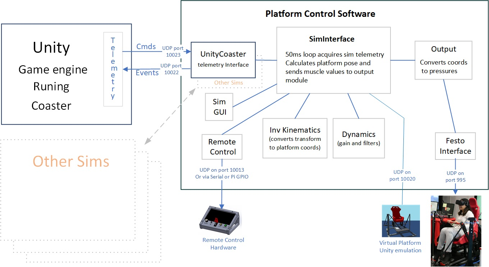

# MdxUnityCoaster
This is a test environment for development of VR roller coasters created in Unity controlling movement of the Middlesex University motion platform.

### Control Software Installation
Install the software by copying all files in the runtime directory to a directory your PC.  The software can run in any directory and no registry entries are needed. 
The software expects Python 3.10 or later with the following modules:
  - numpy
  - pyqt5
  - pyserial

### Unity Coaster Installation
TODO

### Running the software
From a command window in the runtime directory, run: python SimpleSims/SimInterface.py
You can add the following runtime arguments:
 - -l or  --log to set logging level, choices are: 'DEBUG', 'INFO', 'WARNING', 'ERROR', 'CRITICAL'
 - -p or --platform_kinematics to set the platform kinematic type, choice are: 'CHAIR' or 'SLIDER'
 - -f or --festo_ip to set the Festo address

There is a run.bat file in the runtime directory to simplify running a preconfigured option.

Options for selecting sims other than the Unity coaster are configured in runtime/SimpleSims/available_sims.py. See that file for editing available sims and setting defaults.
 

### Software  Overview
All activity is driven from the controller module through service calls that poll the client every 50 milliseconds. The client responds with orientation requests and/ or system commands. Orientation requests are in the form surge, sway, heave, roll, pitch, and yaw. These can be either real world values (mm and radians) or normalized values (values between -1 and 1 representing the maximum range of movement of the platform for each degree of freedom).  
  

### Software comprises the following modules:
 (see comments in source code for more details)

##### Controller (in SimpleSims directory)
+  SimInterface.py - the main system module
+ available_sims.py` - configuration of available sim interfaces

##### Simulator interfaces (in SimpleSims directory)
+  UnityCoaster.py - the interface to the Roller Coaster running under unity
+  nolimits2.py - interface to NoLimits2 roller coaster 
+  spacecoaster.py - a unity game that uses csv telemetry data
+  TestSim.py - a simple UI for controlling transform values 

##### Output directory
+  muscle_output.py  - converts actuator requests to Festo commands
+  output_gui.py` –   pyqt5 UI for setting gains
+  festo_itf.py  - interface to Festo pneumatic pressure control hardware 

#### kinematics directory   
+  dynamics.py - converts normalized values to real world values 
+  kinematicsV2.py - implements inverse kinematics to convert transform to pose
+  cfg_SlidingActuators.py – kinematic definitions for the sliding platform
+  cfg_SuspendedChair.py - kinematic definitions for the supended chair

